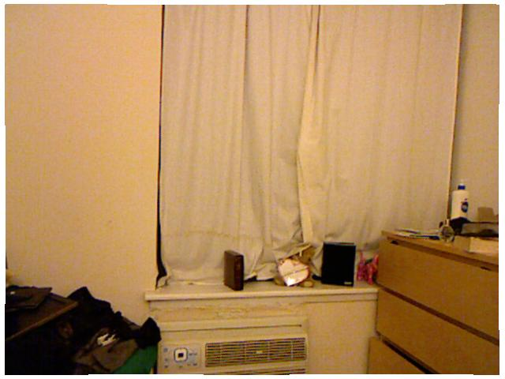
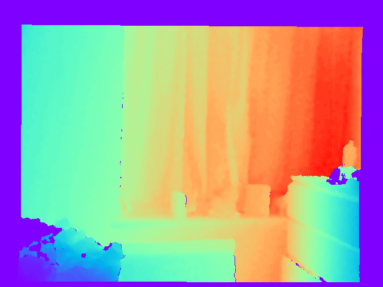
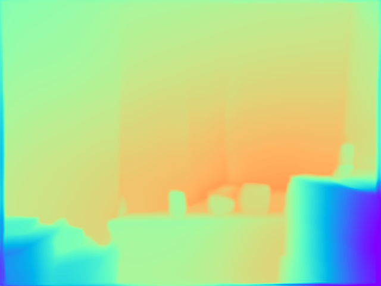
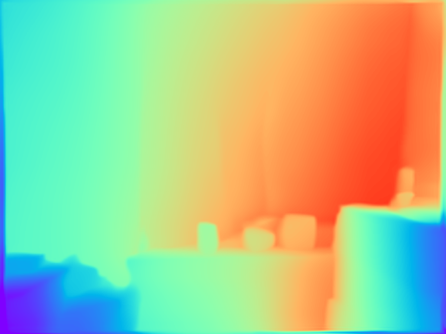

# BoostingDepth

This repository contains the source code of our paper: [Guangkai Xu, Wei Yin, Hao Chen, Kai Cheng, Feng Zhao, Chunhua Shen, Towards 3D Scene Reconstruction from Locally Scale-Aligned Monocular Video Depth (Boosting Monocular Depth Estimation with Sparse Guided Points)](https://arxiv.org/abs/2202.01470)

## Prerequisite

```
conda create -n BoostingDepth python=3.7
conda activate BoostingDepth
pip install -r requirements.txt
```

## Quick Start (Local recovery strategy)

1. (Optional) Run a demo inference.
    ```
    python lwlr.py
    ```

    <table>
    <tr>
        <td>RGB</td>
        <td>GT depth</td>
        <td>Pred depth global</td>
        <td>Pred depth lwlr</td>
    </tr>
    <tr>
        <td></td>  
        <td></td>
        <td></td>
        <td></td>
    </tr>
    </table>

    AbsRel: 0.079 --> 0.017

2. Prepare monocular depth prediction(e.g. [LeReS](https://github.com/aim-uofa/AdelaiDepth)) and sparse depth under `test_imgs/`. The sparse depth should have the same shape as the dense one, but fill with 0 where are invalid. Transfer them to `.npy` files, and organize as follows.

    ```
    |--test_imgs
    |   |--pred_depth_mono
    |   |   |--0.npy
    |   |   |--1.npy
    |   |   |--2.npy
    |   |--sparse_depth
    |   |   |--0.npy
    |   |   |--1.npy
    |   |   |--2.npy
    ```

3. Inference, the output can be seen under `test_imgs/output_lwlr_depth/`
    ```
    python inference_lwlr.py
    ```

## Training & Inference (coming soon...)

