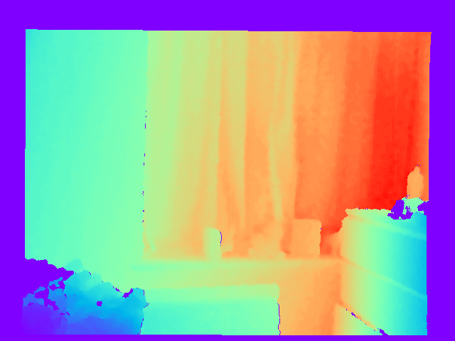

# BoostingDepth

This repository contains the source code of our paper: [Guangkai Xu, Wei Yin, Hao Chen, Kai Cheng, Feng Zhao, Chunhua Shen, Towards 3D Scene Reconstruction from Locally Scale-Aligned Monocular Video Depth (Boosting Monocular Depth Estimation with Sparse Guided Points)](https://arxiv.org/abs/2202.01470)

## Code will be released after received. Thanks for your understanding!

<table>
<tr>
    <td>RGB</td>
    <td>GT depth</td>
    <td>Pred depth global</td>
    <td>Pred depth lwlr</td>
</tr>
<tr>
    <td></td>  
    <td></td>
    <td></td>
    <td></td>
</tr>
</table>

AbsRel: 0.079 --> 0.017

